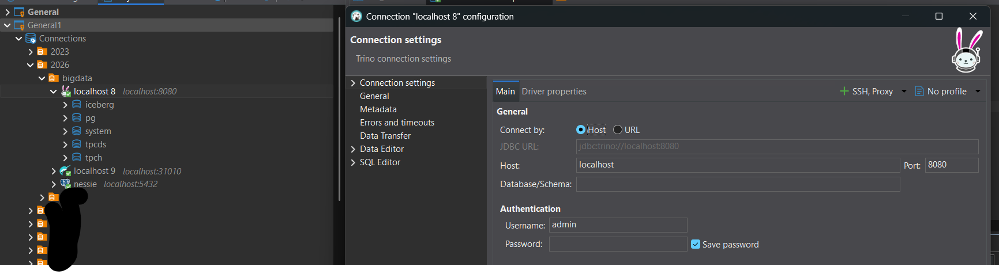
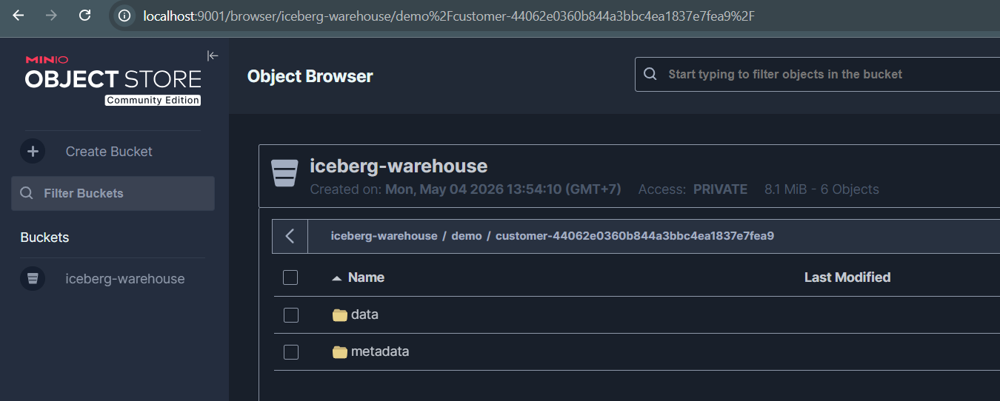
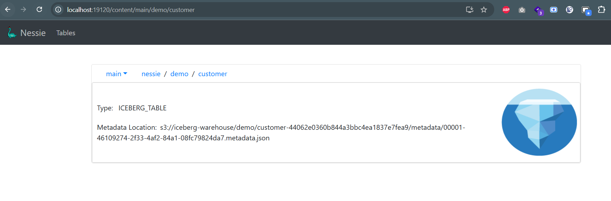

# Modern Big Data Technology Stack (Trino-Based)

This repository documents a modern big data stack based on Trino, along with comparisons to traditional Hadoop ecosystems and alternative query engines like Dremio.

The stack reflects practical implementations used across multiple projects.

## Overview

Modern data platforms are shifting from tightly coupled systems like Hadoop toward cloud-native, modular architectures using:

- Object storage (S3-compatible)
- Distributed SQL engines (Trino / Dremio)
- Table formats like Apache Iceberg
- Containerized deployment (Docker / Kubernetes)

This stack demonstrates a lakehouse architecture with:
- Apache Iceberg for table format
- Nessie for versioned metadata (Git-like)
- Trino for federated SQL queries
- MinIO as S3-compatible object storage

It is suitable for:
- Data Lakehouse
- Multi-source analytics
- Real-time interactive querying

## Hadoop vs Modern Stack (Trino / Dremio)
| Layer / Function | Hadoop Ecosystem | Modern Stack (Trino / Dremio) | Notes |
| -------------------------- | ------------------ | ------------------------------- | ------------------------------------------------ |
| **Storage** | HDFS | S3 / MinIO / GCS / ADLS | Object storage is more scalable and cloud-native |
| **Resource Management** | YARN | Kubernetes / containers | More flexible and cloud-ready |
| **Batch Processing** | MapReduce | Spark / Trino (SQL) | MapReduce is mostly deprecated |
| **SQL Engine** | Hive | Trino / Dremio | Faster and interactive queries |
| **Metadata Catalog** | Hive Metastore | Apache Nessie / Glue | Nessie supports Git-like versioning |
| **File Format** | Text, ORC, Parquet | Parquet / Iceberg | Iceberg supports ACID & schema evolution |
| **Streaming** | Storm / Flink | Kafka + Flink | Kafka is the industry standard |
| **Workflow Orchestration** | Oozie | Airflow / Dagster | More modern and flexible |
| **Security** | Kerberos | IAM / modern RBAC | Simpler in cloud environments |
| **Data Governance** | Apache Ranger | Unity Catalog / Lake Formation | Hadoop governance is complex |
| **Query Acceleration** | Tez | Dremio Reflections | Dremio excels in caching |
| **Federated Query** | Limited | Trino (strong federated engine) | Cross-database queries without ETL |
| **Machine Learning** | Mahout | Python (MLflow, Spark ML) | Python ecosystem dominates |
| **Deployment** | On-prem cluster | Cloud / hybrid / container | More flexible deployment |
| **Scaling** | Manual scaling | Auto-scaling | Elastic scaling in cloud |
| **Maintenance** | High (complex) | Lower | Hadoop is operationally heavy |
| **Latency** | High (batch) | Low (interactive) | Real-time querying capability |

## Known Limitations
### Trino
- Requires predefined catalog configurations in property files
- Less dynamic compared to some managed query engines
### Dremio
- RBAC (Role-Based Access Control) is limited in the Community Edition
- Advanced governance features require Enterprise Edition

## Services Endpoint
| Service | URL | Function | Username | Password |
| ------------- | ------------------------------------------------ | ---------------------------- | -------- | ----------- |
| MinIO Console | [http://localhost:9001](http://localhost:9001) | Object Storage | admin | password123 |
| Nessie API | [http://localhost:19120](http://localhost:19120) | Versioned Metadata Catalog | - | - |
| Trino | [http://localhost:8080](http://localhost:8080) | Distributed SQL Query Engine | admin | - |
| PostgreSQL | - | OLTP Database | nessie | nessie |

## How to Run
1. Run docker compose `docker compose up -d`
2. Create bucket `iceberg-warehouse` in [Minio Ui](http://localhost:9001)
3. Create trino Connection in [Dbeaver](https://dbeaver.io/download/)  and will showing 4 catalogs `iceberg, tpch, tpcds, postgres`.
4. Try simple query in Trino
```sql
SHOW CATALOGS;

# iceberg, create table in iceberg from tpch.sf1.customer table
SHOW SCHEMAS FROM iceberg;
CREATE SCHEMA iceberg.demo;
create table iceberg.demo.customer as select * from tpch.sf1.customer;
select * from iceberg.demo.customer limit 100;

# postgres, create table in potgres from tpcds.sf1.customer table
create schema postgres.demo;
create table postgres.demo.customer as select * from tpcds.sf1.customer;
```
5. Check data in Minio 
6. Check metadata in Minio 

### References
- [Trino Connector](https://trino.io/docs/current/connector.html)
- [Nessie + Iceberg + Trino](https://projectnessie.org/iceberg/trino/)